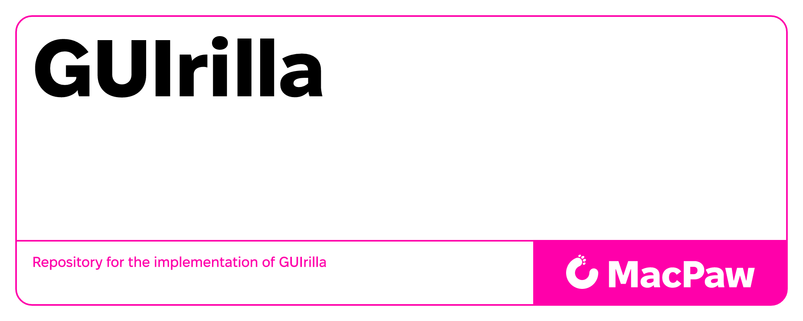
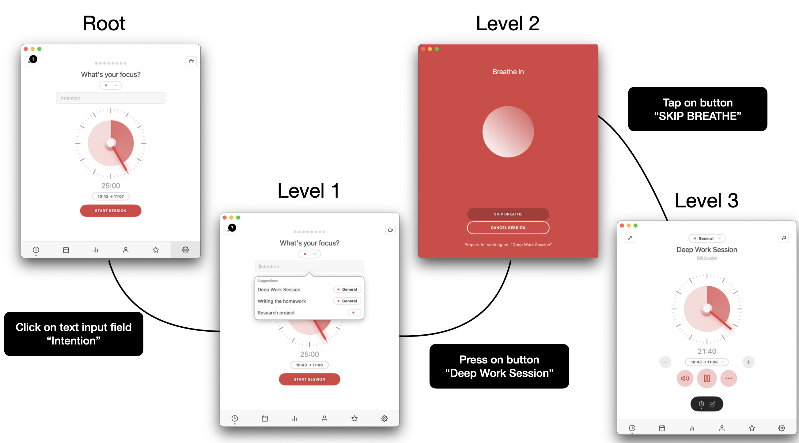
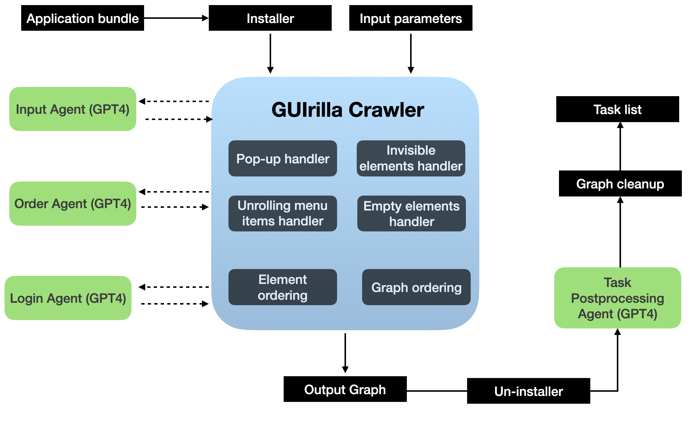

<h1>
  
  GUIrilla: A Scalable Framework for Automated Desktop UI Exploration
</h1>

[](https://arxiv.org/abs/2510.16051)

This repository contains the codebase for the paper **"GUIrilla: A Scalable Framework for Automated Desktop UI Exploration"**. It implements a fully automated system for exploring macOS applications by interacting with their user interfaces and capturing the resulting UI changes. These interactions are structured into a graph-based representation, enabling the scalable collection of tasks across macOS applications.


---

> **🔔 Updates (March 2026)**  
> - 🎉 Our work has been accepted to the **3rd DATA-FM Workshop @ ICLR 2026 (Brazil)**.  
> - We release **GUIrilla-Trees**, a large-scale dataset of accessibility trees for macOS applications, enabling research on structured UI understanding and agent interaction.  
>   👉 https://huggingface.co/datasets/macpaw-research/GUIrilla-Trees

---

## Dataset and models

* [GUIrilla-Task dataset on HuggingFace](https://huggingface.co/datasets/macpaw-research/GUIrilla-Task).
* [GUIrilla-Gold dataset on HuggingFace](https://huggingface.co/datasets/macpaw-research/GUIrilla-Gold).
* [GUIrilla-Trees dataset on HuggingFace](https://huggingface.co/datasets/macpaw-research/GUIrilla-Trees)

**Models:**
* [GUIrilla-See-0.7B on HuggingFace](https://huggingface.co/macpaw-research/GUIrilla-See-0.7B).
* [GUIrilla-See-3B on HuggingFace](https://huggingface.co/macpaw-research/GUIrilla-See-3B).
* [GUIrilla-See-7B on HuggingFace](https://huggingface.co/macpaw-research/GUIrilla-See-7B).
  
___

## 🔧 Requirements

- **macOS**: Version 13.2 or later  
- **Python**: Version 3.11  
- [**OpenAI API Key**](https://platform.openai.com/account/api-keys) *(optional, set env variable `OPENAI_API_KEY` in `.env`)*  
- **macOS System Pass Key**: Set env variable `SYSTEM_PASS` in `.env`
- [**Sentry Client Public Key**](https://docs.sentry.io/api/projects/retrieve-a-client-key/): *(optional, set env variable `SENTRY_CLIENT_PUBLIC_KEY_URL` in `.env`)*
- **Mac App Store CLI (`mas`)** *(optional)*: Required for automatic app installation  
  - Install via [mas GitHub page](https://github.com/mas-cli/mas)  
  - Or run:  
    ```bash
    brew install mas
    ```
  - Then set `-m /Path/to/mas` to simply `mas`
    
---

## 🛡️ Accessibility Permissions

➡️ Ensure the Python interpreter has Accessibility access:

**System Settings > Privacy & Security > Accessibility**

Add the following:

- Terminal 
- Python (or your IDE, e.g., PyCharm or VS Code)  
- Any GUI runner you use

---

## ⚙️ Installation

```bash
python3.11 -m venv parser_venv
source parser_venv/bin/activate
pip install -r requirements.txt
chmod +x ./run_me.sh ./run_me_bulk.sh
```

---

## 🚀 Usage

### 🔹 Single App Processing

```bash
./run_me.sh -a 'Calculator,com.apple.calculator,,os' -o ./output -m /Path/to/mas -h False -c False -l False -q 5 -t True
```

### 🔹 Bulk App Processing

```bash
./run_me_bulk.sh -i app_details_small.txt -o ./output -m /Path/to/mas -l False 
```

---

## ⚙️ Configuration Options



The crawler can be controlled via several flags to modify its behavior:

### 🧠 1. GPT-4 Assistance (Optional)

To use GPT-4 for input generation, element sorting and task generation, ensure an OpenAI API key is available.  
Disable it by setting `-l False`.
This will disable AI-based reasoning, falling back to deterministic inputs, element ordering and handling of login pages.

### 🖱️ 2. Cursor-Based Interaction

Enable cursor movements before actions using `-c True`.
This helps visualize element interactions, such as hover states, by showing cursor positioning as separate actions in the interaction graph.

### 🗂️ 3. Task Collection 

To **collect UI interaction data** without generating action descriptions, use `--tasks False`.
This is useful for building raw interaction graphs or debugging the UI crawling logic.

### 🕔 4. Maximal duration of parsing

The `-q` argument controls the maximal duration of time used by GUIrilla crawler for parsing.
It should be specified in minutes and is an upper bound on the time for processing a single application. By default, it is set to 120 minutes.

---

## 📁 Input Format

For bulk runs, provide an `app_details.txt` file formatted like:

```
Calculator,com.apple.calculator,,os
Stocks,com.apple.Stocks,,os
...
```

---

## 📤 Output

Outputs include segmented UI graphs, screenshots, and logs, stored in the specified output directory (`-o` flag).

---
## 🛠️ Task postprocessing

Run the following command to postprocess the tasks with GPT-4 based Task Agent and add `processed_task` key to a task graph:

```bash
python src/generate_task.py -a Calculator,com.apple.calculator,,os
```

---
## macapptree

As part of the same publication, the `macapptree` library provides complementary functionality to this project. You can find it at [MacPaw/macapptree](https://github.com/MacPaw/macapptree/).

---

## License 
This project is licensed under the MIT License.

## Citation
```
@article{garkot2025guirilla,
  title={GUIrilla: A Scalable Framework for Automated Desktop UI Exploration},
  author={Garkot, Sofiya and Shamrai, Maksym and Synytsia, Ivan and Hirna, Mariya},
  journal={arXiv preprint arXiv:2510.16051},
  year={2025},
  url={https://arxiv.org/abs/2510.16051}
}
```
